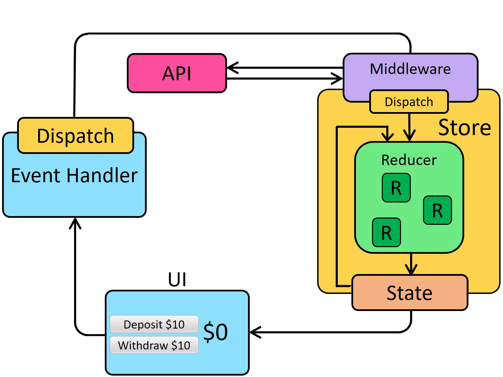
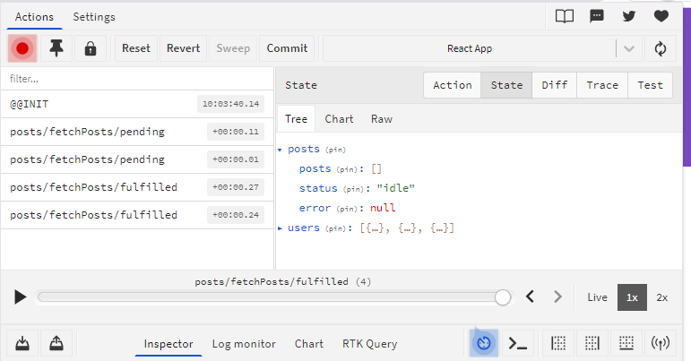
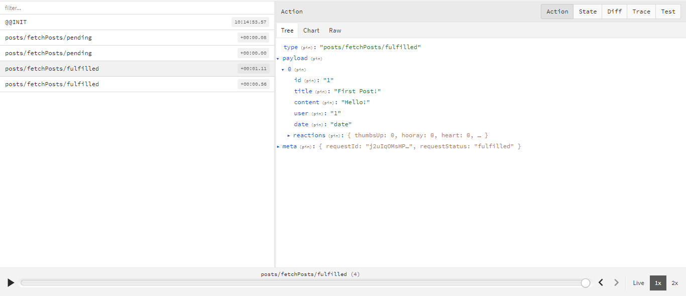

# Introduction

So far, all the data we've worked with has been directly inside of our React client application. However, most real applications need to work with data from a server, by making HTTP API calls to fetch and save items.

In this section, we'll convert our social media app to fetch the posts and users data from an API, and add new posts by saving them to the API.

> Redux Toolkit includes the RTK Query data fetching and caching API. RTK Query is a purpose built data fetching and caching solution for Redux apps, and can eliminate the need to write any thunks or reducers to manage data fetching. 

# Thunks and Async Logic

## Using Middleware to Enable Async Logic
*By itself, a Redux store doesn't know anything about async logic.*

It only knows how to synchronously dispatch actions, update the state by calling the root reducer function, and notify the UI that something has changed. **Any asynchronicity has to happen outside the store.**

*But, what if* you want to have async logic interact with the store by dispatching or checking the current store state? 
*That's where Redux middleware come in.*

They extend the store, and allow you to:
1. Execute extra logic when any action is dispatched (such as logging the action and state)
2. Pause, modify, delay, replace, or halt dispatched actions
3. Write extra code that has access to dispatch and getState
Teach dispatch how to accept other values besides plain action objects, such as functions and promises, by intercepting them and dispatching real action objects instead

> The most common reason to use middleware is to allow different kinds of async logic to interact with the store. 

There are many kinds of async middleware for Redux, and each lets you write your logic using different syntax. The most common async middleware is **redux-thunk**, which lets you write plain functions that may contain async logic directly. 

Redux Toolkit's `configureStore` function automatically sets up the `thunk` middleware by default, and we recommend using `thunks` as a standard approach for writing async logic with Redux. 

Earlier, we saw what the synchronous data flow for Redux looks like. When we introduce asynchronous logic, we add an extra step where middleware can run logic like AJAX requests, then dispatch actions.

| Synchronous | Asynchronous |
| ----------- | ----------- |
|  |  |

# Thunk Functions

"Thunk" is a term used to describe a special type of function that delays the execution of code. Often to perform asynchronous operations, before dispatching an action to the Redux store.

## Adding thunk middleware
Thunk middleware is added to the Redux store to enable the dispatching of thunk function. Once added, we can pass thunk functions directly to `store.dispatch`.

## Thunk function stucture
A thunk function is a function that is always called with `(dispatch, getState)` as its arguments.

## Dispatching plain actions
Thunk typically dispatch actions using action creators (plain actions in redux means an object that has simple form which has type and payload as property.)

```js
const store = configureStore({ reducer: counterReducer })

const exampleThunkFunction = (dispatch, getState) => {
  const stateBefore = getState()
  console.log(`Counter before: ${stateBefore.counter}`)
  dispatch(increment())
  const stateAfter = getState()
  console.log(`Counter after: ${stateAfter.counter}`)
}

store.dispatch(exampleThunkFunction)
```

if your action has another param like `amount` you can make thunk action creator like this:
```js
const logAndAdd = amount => {
  return (dispatch, getState) => {
    const stateBefore = getState()
    console.log(`Counter before: ${stateBefore.counter}`)
    dispatch(incrementByAmount(amount))
    const stateAfter = getState()
    console.log(`Counter after: ${stateAfter.counter}`)
  }
}

store.dispatch(logAndAdd(5))
```

Thunks are typically written in "slice" files. `createSlice` itself does not have any special support for defining thunks, so you should write them as separate functions in the same slice file. 

## Writing async thunks
Thunks may have async logic inside of them, such as `setTimeout`, `Promises`, and `async`/`await`. This makes them a good place to put AJAX calls to a server API.

Data fetching logic for Redux typically follows a predictable pattern:

A "start" action is dispatched before the request, to indicate that the request is in progress. This may be used to track loading state to allow skipping duplicate requests or show loading indicators in the UI.

The async request is made
Depending on the request result, the async logic dispatches either a "success" action containing the result data, or a "failure" action containing error details. The reducer logic clears the loading state in both cases, and either processes the result data from the success case, or stores the error value for potential display.

These steps are not required, but are commonly used. (If all you care about is a successful result, you can just dispatch a single "success" action when the request finishes, and skip the "start" and "failure" actions.)

Redux Toolkit provides a createAsyncThunk API to implement the creation and dispatching of these actions, and we'll look at how to use it shortly.

> If we were to write out the code for a typical async thunk by hand, it might look like this:
> ```js
> const getRepoDetailsStarted = () => ({
>  type: 'repoDetails/fetchStarted'
> })
> const getRepoDetailsSuccess = repoDetails => ({
>  type: 'repoDetails/fetchSucceeded',
>  payload: repoDetails
> })
> const getRepoDetailsFailed = error => ({
>  type: 'repoDetails/fetchFailed',
>  error
> })
> const fetchIssuesCount = (org, repo) => async dispatch => {
>   dispatch(getRepoDetailsStarted())
>   try {
>     const repoDetails = await getRepoDetails(org, repo)
>    dispatch(getRepoDetailsSuccess(repoDetails))
>  } catch (err) {
>    dispatch(getRepoDetailsFailed(err.toString()))
>  }
> }
> ```
> However, writing code using this approach is tedious. Each separate type of request needs repeated similar implementation:
> - Unique action types need to be defined for the three different cases
> - Each of those action types usually has a corresponding action creator function
> - A thunk has to be written that dispatches the correct actions in the right sequence
> `createAsyncThunk` abstracts this pattern by generating the action types and action creators, and generating a thunk that dispatches those actions automatically. You provide a callback function that makes the async call and returns a Promise with the result.

## Fetch post data
Right now, the `postsSlice` state is a single array of `posts`

```js
const initialState = [
  {
    id: "1",
    title: "First Post!",
    content: "Hello!",
    user: "1",
    date: sub(new Date(), { minutes: 10 }).toISOString(),
    reactions: { thumbsUp: 0, hooray: 0, heart: 0, rocket: 0, eyes: 0 },
  },
  {
    id: "2",
    title: "Second Post",
    content: "More text",
    user: "2",
    date: sub(new Date(), { minutes: 5 }).toISOString(),
    reactions: { thumbsUp: 0, hooray: 0, heart: 0, rocket: 0, eyes: 0 },
  },
];
```

We need to change that to be an object that has the posts array, plus the loading state fields. And also we need to change in the UI like `<PostsList>` which expect `state.post` is an array to match the new data.

Example:
``` js
// features/posts/postsSlice.js
// if we dont have reusable selector, we need to change this one by one on each page.
const posts = useSelector((state) => state.posts);
```

> It would be nice if we didn't have to keep rewriting our components **every time we made a change to the data format in our reducers**.

One way to avoid this is **to define reusable selector functions in the slice files**, and have the components use those selectors to extract the data they need instead of repeating the selector logic in each component. That way, **if we do change our state structure again, we only need to update the code in the slice file.**

The `<PostsList>` component needs to read a list of all the posts, and the `<SinglePostPage>` and `<EditPostForm>` components need to look up a single post by its ID. Let's export two small selector functions from postsSlice.js to cover those cases:

``` js
// features/posts/postsSlice.js
export const selectAllPosts = state => state.posts

export const selectPostById = (state, postId) =>
  state.posts.find(post => post.id === postId)

export default postsSlice.reducer
```

and after that, we can use it in the component:
``` js
// features/posts/PostsList.js
// omit imports
import { selectAllPosts } from './postsSlice'

export const PostsList = () => {
    // instead doing this
    // const posts = useSelector((state) => state.posts);
  const posts = useSelector(selectAllPosts)
  // omit component contents
}
```
do the same with the other files

```js
// SinglePostPage.js
import { selectPostById } from './postsSlice'
// const post = useSelector((state) =>
//     state.posts.find((post) => post.id === postId),
//   );
const post = useSelector(state => selectPostById(state, postId))
```

``` js
// features/posts/EditPostForm.js
// omit imports
import { postUpdated, selectPostById } from './postsSlice'

export const EditPostForm = ({ match }) => {
  const { postId } = match.params

  const post = useSelector(state => selectPostById(state, postId))
  // omit component logic
}
```

Maybe you might wondering, when see this:

``` js
const post = useSelector(state => selectPostById(state, postId))
```

why do we put functions inside functions again? instead we just make it like this.

``` js
const post = useSelector(selectPostById(state, postId))
```
Let me explain with you a little bit. I'll give you a simple example. 

Let's assume this is a simple useSelector
``` js
const useSelector = (selector) => {
  // Perform some operations
  console.log("Step 1");

  // Call the selector by providing parameters
  const result = selector("tes");

  // Perform some other operation with the results of the selector
  console.log("Step 3, selector result:", result);
}
```

in our first case, we passed function only.

``` js
const posts = useSelector(selectAllPosts)
```

we can make an analogy like this:
``` js
const yourSelector = (state) => {
  console.log("Step 2, argument:", state);
  // Performs some operations and returns values
  return "return some value";
}
```

if we trigger useSelector like this:
``` js
const useSelector = (selector) => {
  // Perform some operations
  console.log("Step 1");

  // Call the selector by providing parameters
  const result = selector("tes");

  // Perform some other operation with the results of the selector
  console.log("Step 3, selector result:", result);
}

const yourSelector = (state) => {
  console.log("Step 2, argument:", state);
  // Performs some operations and returns values
  return "return some value";
}

useSelector(yourSelector)
// Output:

// Step 1
// Step 2, argument: tes
// Step 3, selector result: return some value
```

it works fine in the first case. However, we cannot equate this to the second case because it accepts 2 arguments.
``` js
const post = useSelector(state => selectPostById(state, postId))
```
if we keep doing the same way then we will get undefined.

We can make an analogy for case two like this:
``` js
// use selector remain thee same..

const yourSelectorCase2 = (state ,action)=>{
  console.log("Step 2, It has two argumen:", "first: ", state," second: ", action);
  // Performs some operations and returns values
  return "return some value";
}

useSelector(yourSelectorCase2)
// Output:
// Step 1
// Step 2, It has two argumen: first:  tes  second:  undefined
// Step 3, selector result: return some value
```
that's because the callback can only hold 1 argument.
``` js
// see this line inside our useSelector function
const result = selector("tes");

// so when we pass our selector case two into the useSelecto function inside the function it limits only one parameter
// selector("tes"); selector function here will replaced to yourSelectorCase2 and the first argument state will be filled with "tes"
// but for the second argument it don't have value :)
```

so to solve this, we need to create a wrapper function that takes its second argument.
``` js
useSelector(state => yourSelectorCase2("1", "2"));

// Output:
// Step 1
// Step 2, It has two argumen: first:  1  second:  2
// Step 3, selector result: return some value
```
this part inside the use selector will be replaced by the callback:
``` js
const useSelector = (selector) => {
  // Perform some operations
  console.log("Step 1");

  // Call the selector by providing parameters
  const result = selector("tes"); // => replaced into this state = "tes" => yourSelectorCase2("1", "2")

  // Perform some other operation with the results of the selector
  console.log("Step 3, selector result:", result);
}

Interesting? Take the time to understand the logic of callback programming in JS if you don't understand it yet
```
## Loading state for request
When we make an API call, we can view its progress as a small state machine that can be in one of four possible states:
- The request hasn't started yet
- The request is in progress
- The request succeeded, and we now have the data we need
- The request failed, and there's probably an error message

We could track that information using some booleans, like `isLoading: true`, but it's better to track these states as a single enum value. A good pattern for this is to have a state section that looks like this (using TypeScript type notation):

``` js
{
  // Multiple possible status enum values
  status: 'idle' | 'loading' | 'succeeded' | 'failed',
  error: string | null
}
```

We can use this information to decide what to show in our UI as the request progresses, and also add logic in our reducers to prevent cases like loading data twice.

Let's update our postsSlice to use this pattern to track loading state for a "fetch posts" request.

We'll switch our state from being an array of posts by itself:
``` js
//features/posts/postsSlice.js
const initialState = [
  {
    id: "1",
    title: "First Post!",
    content: "Hello!",
    user: "1",
    date: sub(new Date(), { minutes: 10 }).toISOString(),
    reactions: { thumbsUp: 0, hooray: 0, heart: 0, rocket: 0, eyes: 0 },
  },
]
```

to look like this `{posts, status, error}`:
``` js
import { createSlice } from "@reduxjs/toolkit";
import { nanoid } from "@reduxjs/toolkit";
import { sub } from "date-fns";

// const initialState = [
//   {
//     id: "1",
//     title: "First Post!",
//     content: "Hello!",
//     user: "1",
//     date: sub(new Date(), { minutes: 10 }).toISOString(),
//     reactions: { thumbsUp: 0, hooray: 0, heart: 0, rocket: 0, eyes: 0 },
//   },
// ];

const initialState = {
  posts: [],
  status: "idle",
  error: null,
};

const postsSlice = createSlice({
  name: "posts",
  initialState,
  reducers: {
    postAdded: {
      reducer(state, action) {
        state.posts.push(action.payload);
      },
      prepare(title, content, userId) {
        return {
          payload: {
            id: nanoid(),
            date: new Date().toISOString(),
            title,
            content,
            user: userId,
            reactions: { thumbsUp: 0, hooray: 0, heart: 0, rocket: 0, eyes: 0 },
          },
        };
      },
    },
    postUpdated(state, action) {
      const { id, title, content } = action.payload;
      const existingPost = state.posts.find((post) => post.id === id);
      if (existingPost) {
        existingPost.title = title;
        existingPost.content = content;
      }
    },
    reactionAdded(state, action) {
      const { postId, reaction } = action.payload;
      const existingPost = state.find((post) => post.id === postId);
      if (existingPost) {
        existingPost.reactions[reaction]++;
      }
    },
  },
});

export const { postAdded, postUpdated, reactionAdded } = postsSlice.actions;

// Maybe you will be confused, the first posts are posts created automatically by Redux (which taken from the names are slice posts), the second posts are slices.
export const selectAllPosts = (state) => state.posts.posts;

export const selectPostById = (state, postId) =>
  state.posts.posts.find((post) => post.id === postId);

export default postsSlice.reducer;
```
Yes, this does mean that we now have a nested object path that looks like `state.posts.posts`, which is somewhat repetitive and silly :) We could change the nested array name to be items or data or something if we wanted to avoid that, but we'll leave it as-is for now.

## Fetching Data with createAsyncThunk

Redux Toolkit's `createAsyncThunk` API generates thunks that automatically dispatch those "start/success/failure" actions for you.
Let's start by adding a thunk that will make an AJAX call to retrieve a list of posts.

Before we start, we can install these package:

```
npm install axios
npm install json-server
```

And setup our fake API by creating db.json
``` json
{
  "posts": [
    {
      "id": "1",
      "title": "First Post!",
      "content": "Hello!",
      "user": "1",
      "date": "date",
      "reactions": {
        "thumbsUp": 0,
        "hooray": 0,
        "heart": 0,
        "rocket": 0,
        "eyes": 0
      }
    }
  ]
}
```

you might also add this into our package.json script:

```
 "fakeapi": "json-server --watch db.json --port 5000"
```

Now you can try to fetch data using `createAsyncThunk`.

``` js
import { createSlice, createAsyncThunk, nanoid } from "@reduxjs/toolkit";
import axios from "axios";

// another code

const initialState = {
  posts: [],
  status: 'idle',
  error: null
}

export const fetchPosts = createAsyncThunk('posts/fetchPosts', async () => {
  const response = await client.get('/fakeApi/posts')
  return response.data
})

```

`createAsyncThunk` accepts two arguments:
1. A string that will be used as the prefix for the generated action types
2. A "payload creator" callback function that should return a `Promise` containing some data, or a rejected `Promise` with an error.

In this case, we pass in 'posts/fetchPosts' as the action type prefix. Our payload creation callback waits for the API call to return a response. 

The response object looks like {data: []}, and we want our dispatched Redux action to have a payload that is just the array of posts. So, we extract response.data, and return that from the callback.

If we try calling `dispatch(fetchPosts())`, the `fetchPosts` thunk will first dispatch an action type of `'posts/fetchPosts/pending'`:

``` js
 useEffect(() => {
    dispatch(fetchPosts());
  }, [dispatch]);
```
We will get this:


We can listen for this action in our reducer and mark the request status as `'loading'`.

Once the `Promise` resolves, the `fetchPosts` thunk takes the `response.data` array we returned from the callback, and dispatches a `'posts/fetchPosts/fulfilled'` action containing the posts array as `action.payload`:


## Dispatching Thunks from Components
So, let's update our `<PostsList>` component to actually fetch this data automatically for us.

We'll import the fetchPosts thunk into the component. Like all of our other action creators, we have to dispatch it, so we'll also need to add the `useDispatch` hook. Since we want to fetch this data when `<PostsList>` mounts, we need to import the React useEffect hook:

``` js
// features/posts/PostsList.js
import React, { useEffect } from 'react'
import { useSelector, useDispatch } from 'react-redux'
// omit other imports
import { selectAllPosts, fetchPosts } from './postsSlice'

export const PostsList = () => {
  const dispatch = useDispatch()
  const posts = useSelector(selectAllPosts)

  const postStatus = useSelector(state => state.posts.status)

  useEffect(() => {
    if (postStatus === 'idle') {
      dispatch(fetchPosts())
    }
  }, [postStatus, dispatch])

  // omit rendering logic
}
```

It's important that we only try to fetch the list of posts once. If we do it every time the `<PostsList>` component renders, or is re-created because we've switched between views, we might end up fetching the posts several times. 

We can use the `posts.status` enum to help decide if we need to actually start fetching, by selecting that into the component and only starting the fetch if the status is 'idle'.

## Reducers and Loading Actions
Next up, we need to handle both these actions in our reducers. This requires a bit deeper look at the `createSlice` API we've been using.

We've already seen that `createSlice` will generate an action creator for every reducer function we define in the reducers field, and that the generated action types include the name of the slice, like:
``` js
console.log(
  postUpdated({ id: '123', title: 'First Post', content: 'Some text here' })
)
/*
{
  type: 'posts/postUpdated',
  payload: {
    id: '123',
    title: 'First Post',
    content: 'Some text here'
  }
}
*/
```

However, there are times when a slice reducer needs to respond to other actions that weren't defined as part of this slice's `reducers` field. We can do that using the slice `extraReducers` field instead.

The `extraReducers` option should be a function that receives a parameter called `builder`. The `builder` object provides methods that let us define additional case reducers that will run in response to actions defined outside of the slice. We'll use `builder.addCase(actionCreator, reducer)` to handle each of the actions dispatched by our async thunks.

he `builder` object in `extraReducers` provides methods that let us define additional case reducers that will run in response to actions defined outside of the slice:

1. `builder.addCase(actionCreator, reducer)`: defines a case reducer that handles a single known action type based on either an RTK action creator or a plain action type string
2. `builder.addMatcher(matcher, reducer)`: defines a case reducer that can run in response to any action where the `matcher` function returns `true`
3. `builder.addDefaultCase(reducer)`: defines a case reducer that will run if no other case reducers were executed for this action.
You can chain these together, like `builder.addCase().addCase().addMatcher().addDefaultCase()`. If multiple matchers match the action, they will run in the order they were defined.

``` js
import { increment } from '../features/counter/counterSlice'

const postsSlice = createSlice({
  name: 'posts',
  initialState,
  reducers: {
    // slice-specific reducers here
  },
  extraReducers: builder => {
    builder
      .addCase('counter/decrement', (state, action) => {})
      .addCase(increment, (state, action) => {})
  }
})
```
In this case, we need to listen for the `"pending"` and `"fulfilled"` action types dispatched by our `fetchPosts` thunk. Those action creators are attached to our actual `fetchPost` function, and we can pass those to `extraReducers` to listen for those actions:


``` js
export const fetchPosts = createAsyncThunk('posts/fetchPosts', async () => {
  const response = await client.get('/fakeApi/posts')
  return response.data
})

const postsSlice = createSlice({
  name: 'posts',
  initialState,
  reducers: {
    // omit existing reducers here
  },
  extraReducers(builder) {
    builder
      .addCase(fetchPosts.pending, (state, action) => {
        state.status = 'loading'
      })
      .addCase(fetchPosts.fulfilled, (state, action) => {
        state.status = 'succeeded'
        // Add any fetched posts to the array
        state.posts = state.posts.concat(action.payload)
      })
      .addCase(fetchPosts.rejected, (state, action) => {
        state.status = 'failed'
        state.error = action.error.message
      })
  }
})
```

We'll handle all three action types that could be dispatched by the thunk, based on the Promise we returned:

1. When the request starts, we'll set the status enum to `'loading'`
2. If the request succeeds, we mark the status as `'succeeded'`, and add the fetched posts to state.posts
3. If the request fails, we'll mark the status as `'failed'`, and save any error message into the state so we can display it

## Displaying Loading State

Our `<PostsList>` component is already checking for any updates to the posts that are stored in Redux, and rerendering itself any time that list changes. So, if we refresh the page, we should see a random set of posts from our fake API show up on screen:

The fake API we're using returns data immediately. However, a real API call will probably take some time to return a response. It's usually a good idea to show some kind of "loading..." indicator in the UI so the user knows we're waiting for data.

We can update our `<PostsList>` to show a different bit of UI based on the `state.posts.status` enum: a spinner if we're loading, an error message if it failed, or the actual posts list if we have the data. While we're at it, this is probably a good time to extract a `<PostExcerpt>` component to encapsulate the rendering for one item in the list as well.

The result might look like this:

``` js
// features/posts/PostsList.js
import { Spinner } from '../../components/Spinner'
import { PostAuthor } from './PostAuthor'
import { TimeAgo } from './TimeAgo'
import { ReactionButtons } from './ReactionButtons'
import { selectAllPosts, fetchPosts } from './postsSlice'

const PostExcerpt = ({ post }) => {
  return (
    <article className="post-excerpt">
      <h3>{post.title}</h3>
      <div>
        <PostAuthor userId={post.user} />
        <TimeAgo timestamp={post.date} />
      </div>
      <p className="post-content">{post.content.substring(0, 100)}</p>

      <ReactionButtons post={post} />
      <Link to={`/posts/${post.id}`} className="button muted-button">
        View Post
      </Link>
    </article>
  )
}

export const PostsList = () => {
  const dispatch = useDispatch()
  const posts = useSelector(selectAllPosts)

  const postStatus = useSelector(state => state.posts.status)
  const error = useSelector(state => state.posts.error)

  useEffect(() => {
    if (postStatus === 'idle') {
      dispatch(fetchPosts())
    }
  }, [postStatus, dispatch])

  let content

  if (postStatus === 'loading') {
    content = <Spinner text="Loading..." />
  } else if (postStatus === 'succeeded') {
    // Sort posts in reverse chronological order by datetime string
    const orderedPosts = posts
      .slice()
      .sort((a, b) => b.date.localeCompare(a.date))

    content = orderedPosts.map(post => (
      <PostExcerpt key={post.id} post={post} />
    ))
  } else if (postStatus === 'failed') {
    content = <div>{error}</div>
  }

  return (
    <section className="posts-list">
      <h2>Posts</h2>
      {content}
    </section>
  )
}
```

// if you are having problem with doubled rendering you must delete React.Strict mode

Don't forget to create Spinner component:
``` js
import React from 'react'

export const Spinner = ({ text = '', size = '5em' }) => {
  const header = text ? <h4>{text}</h4> : null
  return (
    <div className="spinner">
      {header}
      <div className="loader" style={{ height: size, width: size }} />
    </div>
  )
}

```